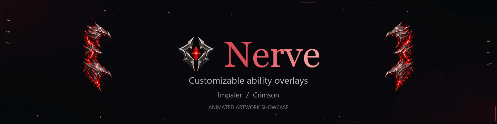
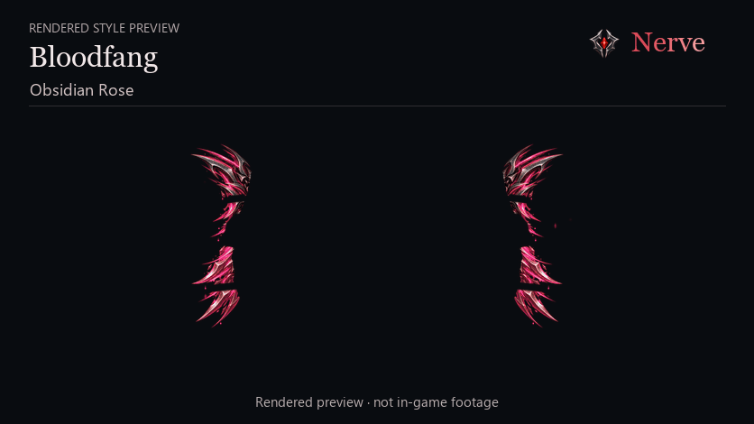
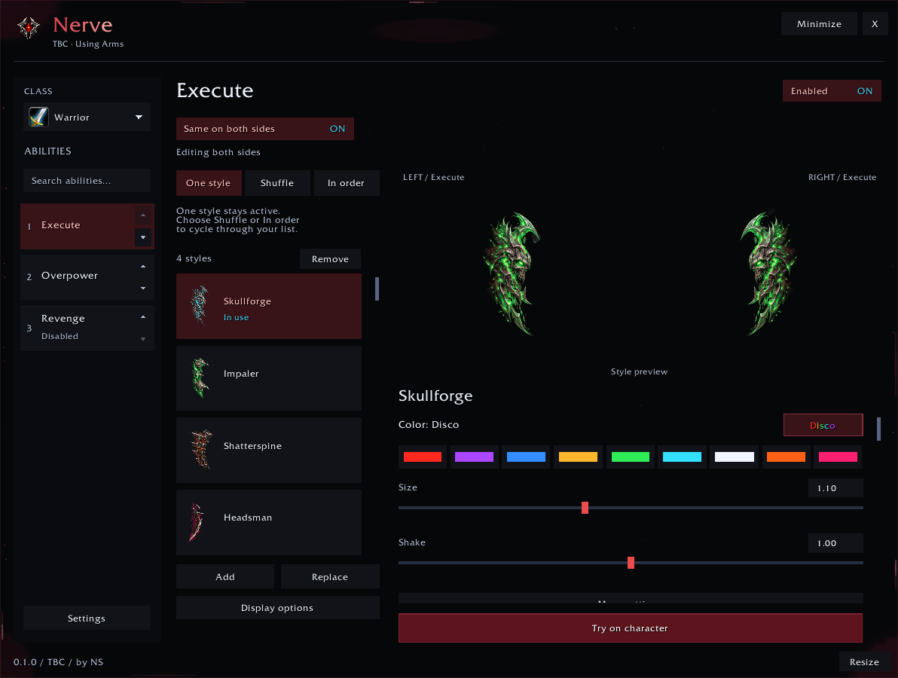

Nerve adds customizable ability overlays for **TBC Anniversary** and **WoW Forever**. Choose your styles and colors, then adjust the look directly on your character.

**[Download on CurseForge](https://www.curseforge.com/wow/addons/nerve)** · [Style gallery](docs/style-gallery.md) · [Setup guide](docs/getting-started.md) · [Report a problem](https://github.com/eggntoast/Nerve-Public/issues/new/choose) · [Changelog](CHANGELOG.md)

Currently supports **Warrior: Execute, Overpower and Revenge**.

## See the styles

*Bloodfang in Obsidian Rose and Impaler in Crimson. Rendered preview, not in-game footage.*

[Explore all twelve styles and more colors →](docs/style-gallery.md)

## Make it yours

* **12 styles, 9 colors and Disco.** Build a collection for each ability. Disco picks a new color when an overlay becomes active.
* **One style, Shuffle or In order.** Keep a favorite or cycle through your collection.
* **Independent sides.** Match the left and right overlays or customize each separately.
* **Try it on your character.** Adjust size, position, shake and appearance before returning to play.

Open **/nerve** or click the minimap icon to get started. The [setup guide](docs/getting-started.md) covers installation, previews and saving your setup.

## Choose your version

| Game client | Download | Settings |
| --- | --- | --- |
| TBC Anniversary | [TBC 0.1.0](https://www.curseforge.com/wow/addons/nerve/files/9036114) | Separate Arms, Fury and Protection setups, with automatic or manual switching. |
| WoW Forever | [Forever 0.1.0](https://www.curseforge.com/wow/addons/nerve/files/9036121) | Per-character settings. |

Choose the version that matches your client. GitHub’s **Code → Download ZIP** is not an installable addon.

Victory Rush in WoW Forever still needs in-game testing. See [downloads and current support](docs/downloads.md).

## Class support

**0.1.0 is the Warrior release**, with twelve styles for the supported abilities. The plan is to add the other classes one at a time until all nine are supported. For now, Nerve supports Warrior only.

Display priority chooses which overlay appears. Nerve isn’t a rotation guide.

## Help and updates

[Get help](docs/help.md) · [Report a problem](https://github.com/eggntoast/Nerve-Public/issues/new/choose) · [Read the changelog](CHANGELOG.md)

This repository is Nerve’s public gallery and help hub. Download the addon from [CurseForge](https://www.curseforge.com/wow/addons/nerve).

Made by **NS**. Code and documentation use the [MIT license](LICENSE). Artwork and branding have [separate terms](ASSET_LICENSE.md).
