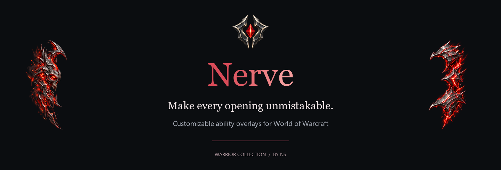
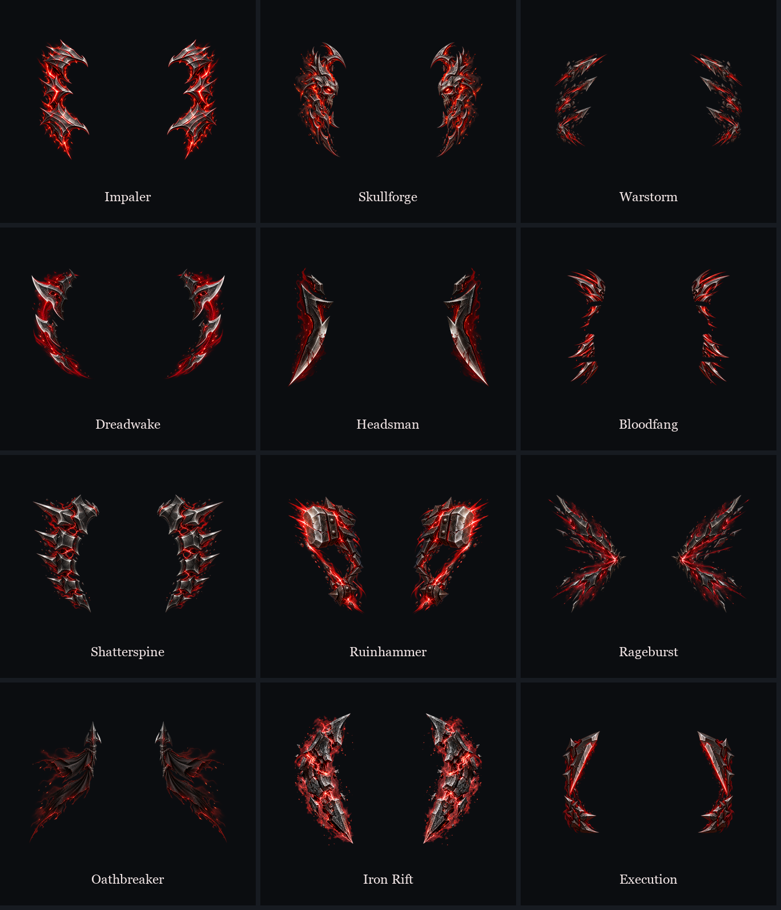

# Your abilities. Your look.

Give Execute, Overpower and Revenge a look of their own. Choose from twelve Warrior styles, pick your colors and fine-tune the overlays directly on your character.

[Downloads](docs/downloads.md) · [Explore the styles](#twelve-styles-one-warrior) · [Getting started](docs/getting-started.md) · [Get help](https://github.com/eggntoast/Nerve-Public/issues/new/choose) · [Changelog](CHANGELOG.md)

## Twelve styles. One Warrior.

Forged steel, fractured energy and sharp silhouettes. Pick one favorite, shuffle your collection or cycle through it in order.

Impaler · Skullforge · Warstorm · Dreadwake · Headsman · Bloodfang · Shatterspine · Ruinhammer · Rageburst · Oathbreaker · Iron Rift · Execution

*Static artwork previews from the current approved textures. In-game lighting, motion and particles are not shown here.*

## Make it yours

- **Nine colors, plus Disco.** Choose a fixed color or let Disco choose a new color when the overlay becomes active.
- **One style, Shuffle or In order.** Build a collection for each ability and choose how it changes.
- **Together or independently.** Keep both sides the same, or give left and right their own appearance.
- **Try it on your character.** Adjust size, vertical position, shake and more while viewing your HUD preview.
- **Keep your setup.** Save backups and copy settings from another compatible character.
- **A little atmosphere.** Optional window effects decorate the settings windows; their toggle does not turn off your ability effects.

## See the direction

[About this motion preview](docs/motion-showcase.md)

*Browser concept, not in-game footage. This concept uses earlier interface screenshots to demonstrate the approved branding and window treatment. Its older controls are not a current UI guide. A launch showcase should use footage from the accepted in-game build.*

## Choose your client

| Edition | Current scope |
| --- | --- |
| TBC Anniversary | Warrior: Execute, Overpower and Revenge. Separate Arms, Fury and Protection setups, with automatic or manual selection. |
| WoW Forever | Warrior: Execute, Overpower and Revenge. Per-character settings. Victory Rush support is implemented but still awaits native verification. |

Only Warrior is currently supported. Display priority controls which overlay is visible; it is not a rotation guide.

## Getting started

1. Download the package matching your client when the release is available.
2. Place the ZIP's `Nerve` folder in `Interface/AddOns` and enable the addon.
3. Open `/nerve` or click the minimap icon. Select an ability and choose your style.
4. Use **Try on character** to adjust the look, then **Stop preview** when finished. Entering combat also ends the manual preview.

Use the packaged addon ZIP. GitHub's automatic source archives are not the installable addon.

## Downloads

Nerve 0.1.0 is currently a release candidate. Public downloads will be linked here once the release is approved. Choose the correct client build; do not combine TBC and Forever packages.

## Get help

When reporting a problem, include the version and build shown in **About**, your client version, what happened and any Lua error. A screenshot can help; hide character or account information you do not want to share.

[Report a problem or suggest an improvement](https://github.com/eggntoast/Nerve-Public/issues/new/choose). See the [changelog](CHANGELOG.md) for player-facing updates. No full SavedVariables upload is needed to start a report.

## Credits and licensing

Nerve by **NS**. Original code and documentation use the [MIT license](LICENSE). Artwork and branding have [separate reserved-rights terms](ASSET_LICENSE.md).

This repository currently hosts the presentation and player help. Released addon source and packages will follow separately; no installable addon is included yet.
