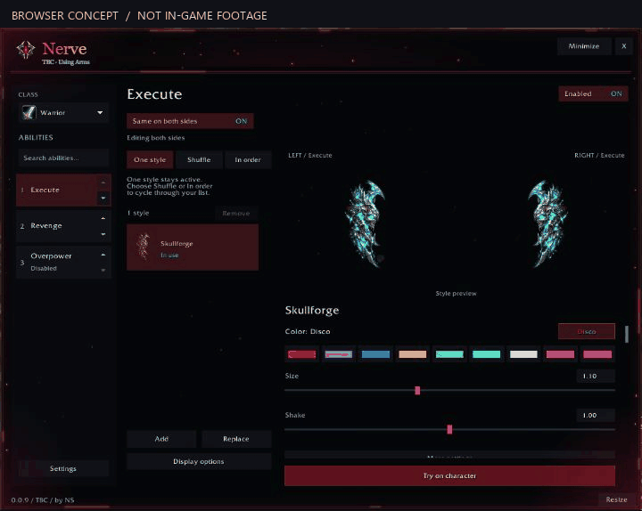

# Earlier window concept

This is an earlier design preview, kept for reference. See the [current style gallery](style-gallery.md) and [in-game settings screenshot](getting-started.md) for the current presentation.

This browser mockup shows the proposed slow crimson highlights, edge embers and interior dust over an older Nerve screenshot. The overlay artwork is static, and the older controls are not a guide to the current interface.

It is not a recording from World of Warcraft and does not establish the addon’s in-game appearance or performance.

[Back to Nerve](../README.md)
