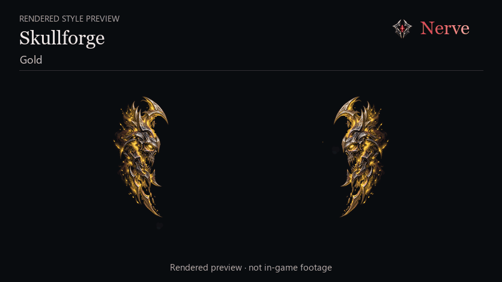
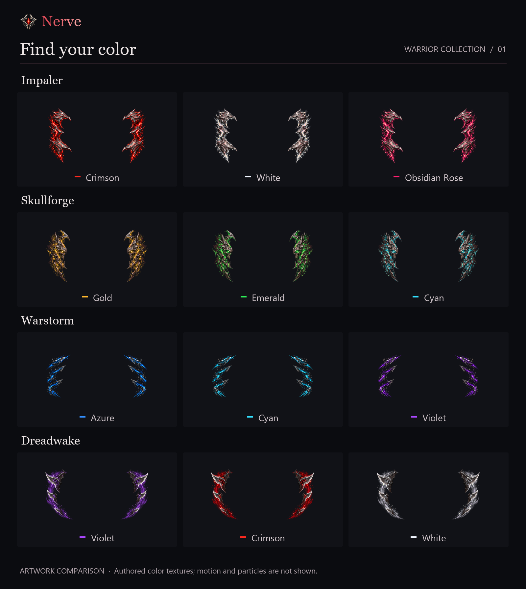
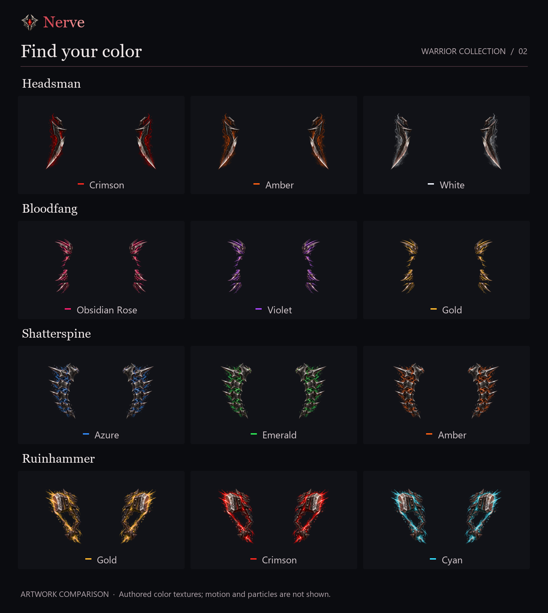
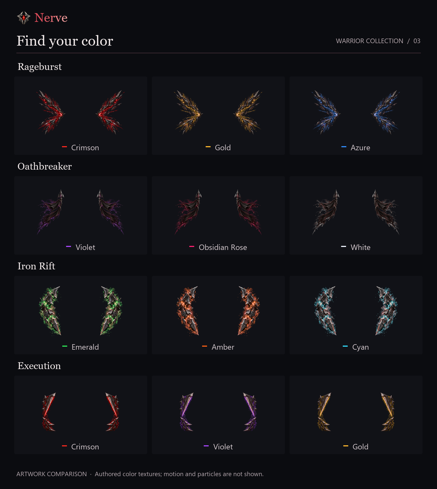

# Warrior style gallery

Twelve styles, with three color examples for each. Every style has nine colors available in Nerve, plus Disco.

[Download Nerve](https://www.curseforge.com/wow/addons/nerve) · [Setup guide](getting-started.md) · [Back to Nerve](../README.md)

## Styles in motion

These are rendered previews, not recordings from WoW. They haven’t been compared with the game yet.

### Skullforge and Warstorm

Skullforge in **Gold**, followed by Warstorm in **Cyan**. [View a still preview](../assets/nerve-effects-01-poster.png).

### Bloodfang and Impaler

Bloodfang in **Obsidian Rose**, followed by Impaler in **Crimson**. [View a still preview](../assets/nerve-effects-02-poster.png).

## Pick your colors

The sheets below show still artwork; movement and particles aren’t shown. Click a sheet to see it at full size.

### Impaler, Skullforge, Warstorm and Dreadwake

### Headsman, Bloodfang, Shatterspine and Ruinhammer

### Rageburst, Oathbreaker, Iron Rift and Execution

## Try them yourself

Open **/nerve**, choose an ability and style, then select **Try on character**. Use **Stop preview** when finished; entering combat also ends the preview.

[Download Nerve](https://www.curseforge.com/wow/addons/nerve) · [Back to Nerve](../README.md)
